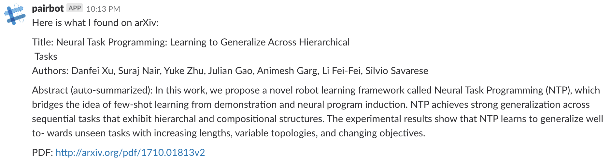

# ArxivBot
This is a Slack bot that posts arXiv summaries in a channel
built based on this tutorial: https://www.fullstackpython.com/blog/build-first-slack-bot-python.html

## Quick start
- Follow this [instruction](https://www.fullstackpython.com/blog/build-first-slack-bot-python.html)
to create a slack bot (you are free to choose a name) and obtain the slack bot token. 

- Export the environment variable to the computer you want to deploy the bot
```
export SLACK_BOT_TOKEN=<your-slack-bot-token>
```

- Edit your slack handle in `bot.py`

- Install all dependencies by pip install -r requirements.txt

- Start the bot by python bot.py


## Interact with the bot

Invite the bot user to a channel, then mention the bot at the beginning of your message, and include a 
arxiv link in your message. For example, say the username of your bot is `arxivbot`. After typing

```
@arxivbot, give me a summary of https://arxiv.org/abs/1710.01813
```

, the bot (hopefully) will respond with


